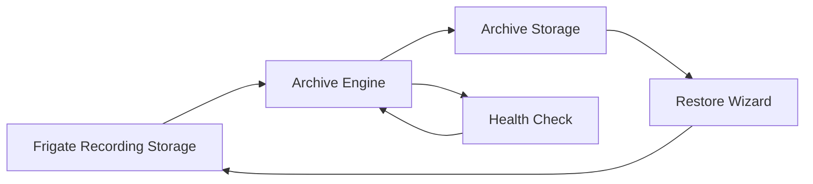
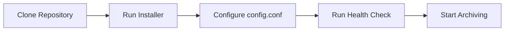

<div align="center">


# Frigate Archive

### Archive and Restore Toolkit for Frigate on Unraid

Safely archive, restore, and manage Frigate recordings with verified transfers, automated cleanup, and built-in health validation.

<p>
    
    
    
    
</p>

</div>

---

# Why Frigate Archive?

Frigate performs best when recording to fast local storage such as an SSD or cache drive. Over time, however, continuous recording consumes available space and eventually requires manual cleanup or larger storage devices.

Frigate Archive automates this process by safely moving completed recordings to long-term archive storage while preserving data integrity and keeping your recording storage available for new footage.

Unlike simple copy scripts, Frigate Archive verifies every transfer before removing the original recordings, performs automatic Frigate database cleanup, validates your installation before every deployment, and provides an interactive Restore Wizard for recovering archived footage whenever you need it.

Designed specifically for **Unraid** and **Frigate**, the project focuses on reliability, maintainability, and protecting your recordings throughout the archive lifecycle.

---

# Features

| Feature | Description |
|---------|-------------|
| 📦 **Archive Engine** | Automatically archives recordings when storage reaches a configurable threshold. |
| 🔄 **Restore Wizard** | Browse and restore archived recordings safely with checksum verification. |
| ❤️ **Health Check** | Validate your installation, configuration, modules, and runtime environment. |
| ⚙️ **Installer** | Guided installation and configuration validation. |
| 🧹 **Uninstaller** | Safely remove runtime files while preserving recordings and configuration. |
| 📝 **Detailed Logging** | Comprehensive logging for archive, restore, installer, and health operations. |
| 🔒 **Safety First** | Verification, lock files, runtime validation, and conservative defaults help protect your recordings. |

---

# Quick Start

Clone the repository:

```bash
git clone https://github.com/JWMutant/frigate-archive.git
```

Enter the project:

```bash
cd frigate-archive
```

Run the installer:

```bash
bash install.sh
```

Validate the installation:

```bash
bash healthcheck.sh
```

Run a test archive:

```bash
bash archive.sh
```

Browse archived recordings:

```bash
bash restore.sh
```

> **Tip**
>
> Leave `TEST_MODE=true` until you've verified that your configuration and archive workflow are working correctly.

---

# How It Works



Frigate Archive continuously monitors your recording storage. When the configured threshold is reached, the Archive Engine safely transfers older recordings to archive storage, verifies every transfer, cleans the Frigate database, and returns the recording storage to a healthy operating level.

Whenever archived footage is required, the Restore Wizard provides a guided, interactive restore process with built-in validation and checksum verification.

---

# Documentation

Comprehensive documentation is available in the `docs/` directory.

| Guide | Description |
|-------|-------------|
| [Getting Started](docs/getting-started.md) | Install, configure, and test Frigate Archive in minutes. |
| [Installation](docs/installation.md) | Complete installation and upgrade guide. |
| [Configuration](docs/configuration.md) | Configure paths, thresholds, Test Mode, and runtime options. |
| [Archive Engine](docs/archive-engine.md) | Learn how automatic archiving works. |
| [Restore Wizard](docs/restore-wizard.md) | Restore archived recordings safely with verification. |
| [Health Check](docs/healthcheck.md) | Validate your installation and diagnose problems. |
| [Troubleshooting](docs/troubleshooting.md) | Resolve common issues and understand error messages. |
| [Developer Guide](docs/developer-guide.md) | Project architecture, coding standards, and release process. |
| [FAQ](docs/faq.md) | Frequently asked questions and best practices. |

---

# Project Philosophy

Frigate Archive was designed around four core principles.

## 🛡️ Safety

Recordings are never removed until transfers have been successfully verified.

Every major operation is designed to minimise the risk of accidental data loss.

---

## ✅ Reliability

Archive and restore operations include multiple validation steps before making changes.

Health Check verifies the environment before problems become failures.

---

## 🧩 Maintainability

The project uses a modular architecture that separates archive, restore, installer, and validation logic into focused components.

This makes the project easier to maintain, extend, and troubleshoot.

---

## 🔍 Transparency

Every major operation is logged with clear, meaningful output.

When something goes wrong, Frigate Archive should explain **what happened** and **why**.

---

# Core Components

| Component | Purpose |
|-----------|---------|
| 📦 Archive Engine | Automatically archives recordings based on configurable storage thresholds. |
| 🔄 Restore Wizard | Interactively restores archived recordings with verification. |
| ❤️ Health Check | Validates the installation, project structure, runtime environment, and Git repository. |
| ⚙️ Installer | Prepares the project for first use and validates configuration. |
| 🧹 Uninstaller | Removes runtime files while preserving recordings and user data. |

---

# Project Structure

```text
frigate-archive/
├── archive.sh
├── restore.sh
├── install.sh
├── uninstall.sh
├── healthcheck.sh
├── VERSION
├── CHANGELOG.md
├── README.md
├── CONTRIBUTING.md
├── SECURITY.md
├── LICENSE
├── config.conf.example
│
├── docs/
│   ├── getting-started.md
│   ├── installation.md
│   ├── configuration.md
│   ├── archive-engine.md
│   ├── restore-wizard.md
│   ├── healthcheck.md
│   ├── troubleshooting.md
│   ├── developer-guide.md
│   └── faq.md
│
├── modules/
│   ├── archive/
│   └── restore/
│
└── assets/
```

---

# Installation Overview

Install Frigate Archive in four simple steps.



Detailed installation instructions are available in the **Getting Started** and **Installation** guides.

---

# Safety Features

Frigate Archive is designed with a **safety-first** philosophy. Before any archive or restore operation modifies your data, multiple validation steps are performed to help protect your recordings.

| Safety Feature | Purpose |
|---------------|---------|
| ✅ Verification Before Deletion | Original recordings are never removed until transferred files have been successfully verified. |
| 🔒 Runtime Lock Files | Prevents multiple archive or restore operations from running simultaneously. |
| ❤️ Health Check | Detects configuration and runtime problems before they cause failures. |
| 📋 Detailed Logging | Records every significant action for troubleshooting and auditing. |
| 🧪 Test Mode | Allows the complete archive workflow to be validated without moving recordings or modifying the Frigate database. |
| 🗄️ Database Cleanup | Removes stale Frigate database entries after successful archive operations. |

---

# Roadmap

## Completed

- ✅ Archive Engine
- ✅ Restore Wizard
- ✅ Installer
- ✅ Uninstaller
- ✅ Health Check
- ✅ Documentation Library
- ✅ GitHub Actions
- ✅ ShellCheck Integration
- ✅ Professional Project Structure

## Planned

- 📸 Project screenshots
- 🎨 Enhanced Mermaid workflow diagrams
- 🧩 Shared `modules/common/` framework
- 🗄️ Optional Frigate metadata restoration
- 🧪 Expanded automated testing
- 🌐 GitHub Pages documentation site

---

# Compatibility

Frigate Archive is currently developed and tested on:

| Component | Supported |
|----------|-----------|
| Unraid | ✅ |
| Frigate | ✅ |
| Docker | ✅ |
| Bash | ✅ |

Support for other Linux distributions may be considered in future releases but is not currently an official project goal.

---

# Contributing

Contributions are welcome.

If you would like to report a bug, suggest an enhancement, or contribute code, please review the following documents before opening a Pull Request:

- [Contributing Guide](CONTRIBUTING.md)
- [Security Policy](SECURITY.md)

Please run the following before submitting changes:

```bash
bash healthcheck.sh

find . -name "*.sh" -exec bash -n {} \;
```

This helps ensure that new contributions meet the project's quality standards.

---

# Support

If you experience a problem:

1. Run:

```bash
bash healthcheck.sh
```

2. Review the generated log output.

3. Consult the documentation in the `docs/` directory.

4. Search existing GitHub Issues.

5. If the problem persists, open a new GitHub Issue using the Bug Report template.

Providing the Health Check summary and relevant log output will greatly assist with troubleshooting.

---

# License

This project is licensed under the MIT License.

See the [LICENSE](LICENSE) file for details.

---

<div align="center">

**Frigate Archive**

Archive and Restore Toolkit for Frigate on Unraid

Built with reliability, safety, and maintainability in mind.

If this project has been helpful, consider giving it a ⭐ on GitHub.

</div>
