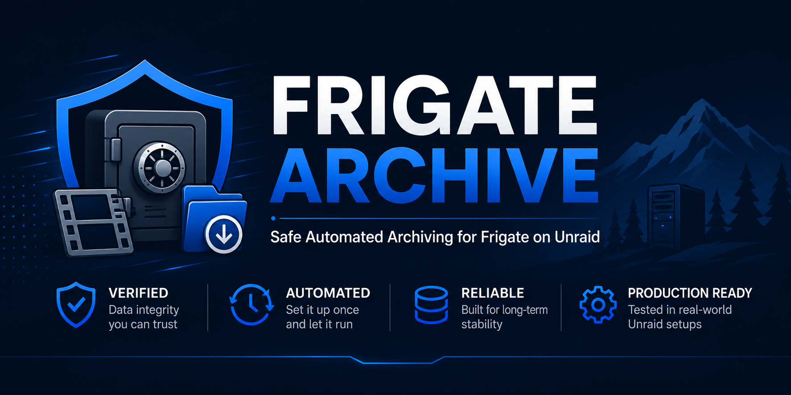
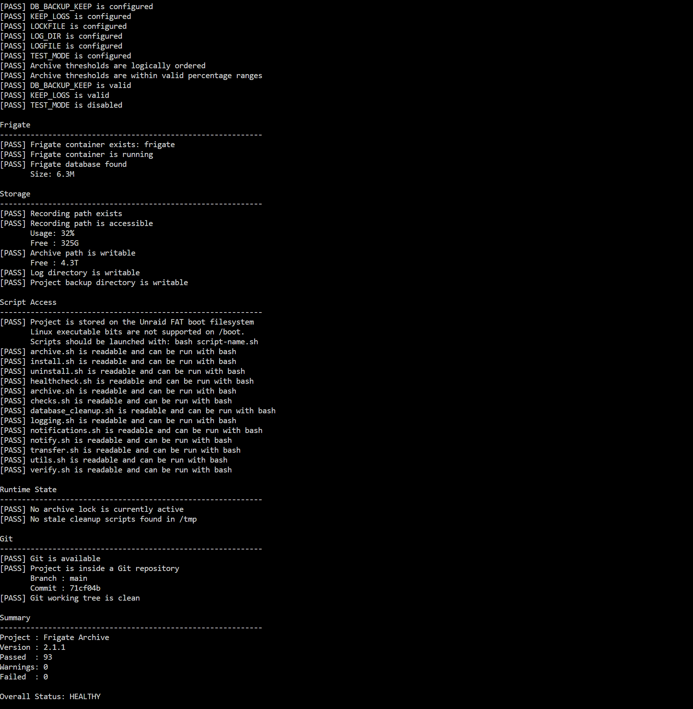

<p align="center">
  
</p>

<div align="center">

# 📦 Frigate Archive

### Safe Automated Archiving for Frigate running on Unraid

Automatically archive completed Frigate recordings to long-term storage while keeping the Frigate database synchronized.

---


</div>

---

# Overview

Frigate Archive is a production-tested archive system designed specifically for **Frigate running on Unraid**.

It automatically moves completed recordings from fast recording storage to long-term archive storage while safely maintaining the Frigate SQLite database.

Unlike simple file-copy scripts, Frigate Archive performs integrity verification before removing recordings and keeps Frigate's database synchronized throughout the process.

---

# Why Frigate Archive?

As Frigate installations grow, recording drives eventually fill up.

Many users manually move recordings to another disk, but doing so often leaves:

- orphaned database records
- incorrect storage statistics
- broken timeline entries
- missing previews
- inconsistent recording history

Frigate Archive automates the entire process safely.

---

# Features

## Archive Engine

- ✅ Automatic archive based on storage usage
- ✅ Configurable archive thresholds
- ✅ Safe rsync transfers
- ✅ Existing archive detection
- ✅ Archive verification
- ✅ Automatic cleanup of source recordings

---

## Database Management

- ✅ SQLite database backup
- ✅ Automatic cleanup
- ✅ Transaction protection
- ✅ VACUUM optimization
- ✅ Verification after cleanup

---

## Safety

- ✅ Verification before deleting recordings
- ✅ Automatic rollback on failure
- ✅ Lock file protection
- ✅ Test Mode
- ✅ Production tested

---

## Utilities

- ✅ Installer
- ✅ Uninstaller
- ✅ Health Check
- ✅ Configuration template
- ✅ Detailed logging

---

# How It Works

```text
Frigate Recording Drive
          │
          ▼
Completed Recording Day
          │
          ▼
Archive Verification
          │
          ▼
Safe rsync Transfer
          │
          ▼
Integrity Verification
          │
          ▼
Remove Original Recordings
          │
          ▼
Database Cleanup
          │
          ▼
Archive Complete
```

---

# Installation

Clone the repository:

```bash
git clone https://github.com/JWMutant/frigate-archive.git
```

Move into the project:

```bash
cd frigate-archive
```

Run the installer:

```bash
bash install.sh
```

---

# Configuration

Copy the example configuration if required:

```bash
cp config.conf.example config.conf
```

Edit:

```bash
nano config.conf
```

Configure:

- Recording location
- Archive location
- Frigate container
- Database location
- Archive thresholds

---

# First Run

Leave:

```bash
TEST_MODE=true
```

Run:

```bash
bash archive.sh
```

Review the output.

Once satisfied:

```bash
TEST_MODE=false
```

---

# Health Check

Validate the installation at any time:

```bash
bash healthcheck.sh
```

Example:

```text
Overall Status: HEALTHY
```

<p align="center">
  
</p>

---

---

# Safety Guarantees

Frigate Archive removes source recordings only after:

- The archive transfer completes successfully
- Verification confirms the source files exist in the archive

Database cleanup then removes the archived day's stale Frigate records. A database backup is created before cleanup, and database changes are performed inside a transaction.

---

# Tested On

- Unraid 7.3.1
- Frigate 0.17.x
- NVIDIA GPU
- Multiple cameras
- Production recording environments
- Existing archive destinations
- Fresh archive destinations

---

# Project Structure

```text
frigate-archive/

├── archive.sh
├── install.sh
├── uninstall.sh
├── healthcheck.sh
├── VERSION
├── LICENSE
├── CHANGELOG.md
├── README.md
├── config.conf.example
└── modules/
```

---

# Roadmap

## Completed

- [x] Safe archive engine
- [x] Verification
- [x] Database cleanup
- [x] Installer
- [x] Uninstaller
- [x] Health Check
- [x] GitHub Releases
- [x] Centralized version management

## Planned

- [ ] Restore utility
- [ ] Email notifications
- [ ] Discord notifications
- [ ] Multi-destination archive
- [ ] GitHub Actions
- [ ] Configuration validation wizard

---

# Contributing

Issues, bug reports and feature requests are welcome.

If you find a problem, please open a GitHub Issue.

Pull requests are also welcome.

---

# License

Released under the MIT License.

---

# Acknowledgements

Frigate Archive was developed and tested on a live Unraid server running Frigate.

The project was built with a focus on reliability, recoverability and safe long-term storage management.

---

<div align="center">

### ⭐ If Frigate Archive has been useful, please consider starring the repository!

</div>
