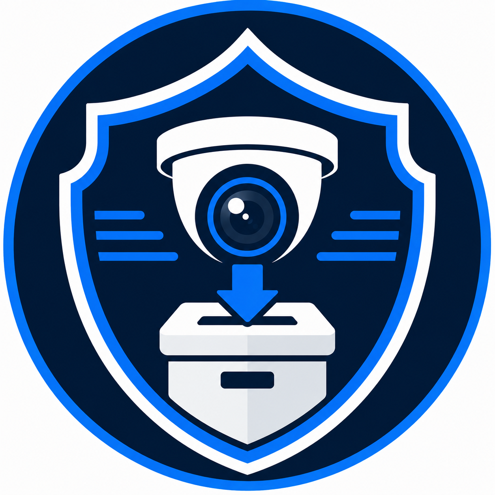
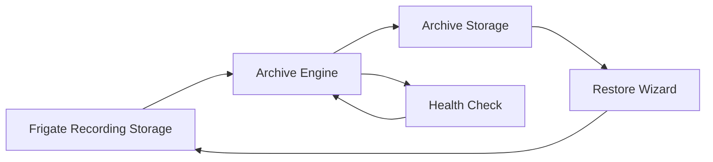
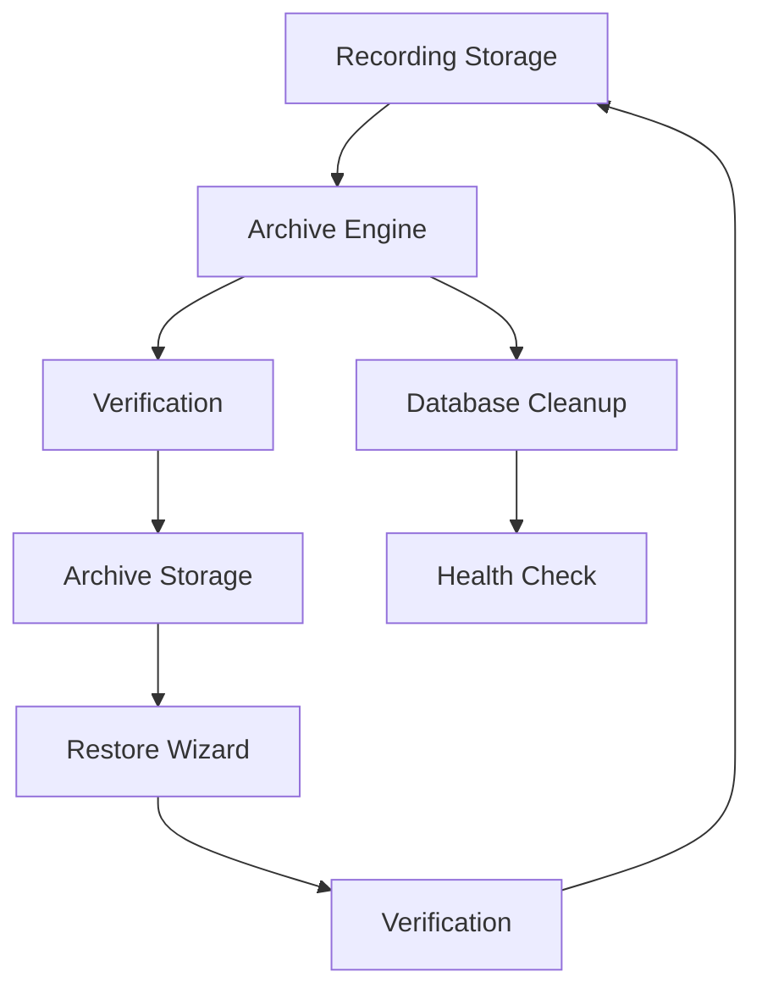
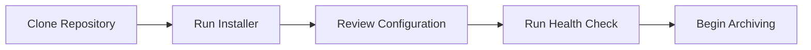

<div align="center">



# Frigate Archive

### Archive and Restore Toolkit for Frigate on Unraid

Safely archive, restore, and manage Frigate recordings with verified transfers, automated cleanup, and built-in health validation.

<p>


</p>

</div>

---

> **Current Release**
>
> **Version 2.3.0** introduces the Restore Wizard, a fully modular project structure, improved installation tools, Health Check enhancements, and a comprehensive documentation library.

---

# Why Frigate Archive?

Frigate is exceptionally good at recording video.

Managing those recordings over time is a different challenge.

Continuous recording quickly fills fast SSD or cache storage, forcing administrators to manually move files, delete recordings, or purchase additional storage. Simple copy scripts solve part of the problem, but they rarely provide verification, database maintenance, logging, or safe recovery when something goes wrong.

Frigate Archive was created to solve this problem.

Instead of simply copying recordings, Frigate Archive provides a complete archive management toolkit designed specifically for **Frigate running on Unraid**.

Every archive operation is verified before original recordings are removed. Every restore is validated before files are returned. Every major component is designed around one principle:

> **Protect your recordings first.**

---

# Why Choose Frigate Archive?

| | |
|---|---|
| 📦 **Automatic Archiving** | Moves completed recordings from recording storage to long-term archive storage. |
| 🔄 **Interactive Restore Wizard** | Browse, preview, and safely restore archived recordings whenever required. |
| ❤️ **Health Check** | Validate your installation, configuration, runtime environment, and project integrity. |
| 🛡️ **Verification First** | Recordings are never deleted until transferred files have been successfully verified. |
| 📝 **Professional Logging** | Archive, restore, installer, and Health Check operations generate detailed logs. |
| ⚙️ **Guided Installation** | Installer validates project structure, configuration, runtime environment, and shell syntax. |
| 🧹 **Runtime Cleanup** | Remove runtime files without affecting recordings or archived data. |
| 🧩 **Modular Architecture** | Archive Engine and Restore Wizard are organised into reusable modules for easier maintenance. |

---

# Quick Start

Clone the repository:

```bash
git clone https://github.com/JWMutant/frigate-archive.git
```

Enter the project:

```bash
cd frigate-archive
```

Run the installer:

```bash
bash install.sh
```

Validate the installation:

```bash
bash healthcheck.sh
```

Perform a test archive:

```bash
bash archive.sh
```

Browse archived recordings:

```bash
bash restore.sh
```

> **Tip**
>
> Keep `TEST_MODE=true` until you've completed your initial testing. Test Mode allows the complete archive workflow to be validated without moving recordings or modifying the Frigate database.

---

# At a Glance



Frigate Archive continuously monitors recording storage usage. When the configured threshold is reached, the Archive Engine safely transfers older recordings to archive storage, verifies every transferred file, performs database cleanup, and returns recording storage to a healthy operating level.

Whenever archived footage is needed, the Restore Wizard provides an interactive workflow that validates available storage, restores recordings, verifies file integrity, and preserves the archived copy for future use.

---

# Documentation

Frigate Archive includes a comprehensive documentation library covering installation, configuration, operation, troubleshooting, and development.

Whether you're installing the project for the first time or contributing new features, the documentation is designed to guide you through every stage.

| Guide | Description |
|-------|-------------|
| 📖 [Getting Started](docs/getting-started.md) | Install and test Frigate Archive in just a few minutes. |
| ⚙️ [Installation](docs/installation.md) | Complete installation, upgrade, and deployment guide. |
| 🔧 [Configuration](docs/configuration.md) | Configure paths, thresholds, Test Mode, and runtime options. |
| 📦 [Archive Engine](docs/archive-engine.md) | Learn how automatic archiving works and why it is designed this way. |
| 🔄 [Restore Wizard](docs/restore-wizard.md) | Restore archived recordings safely using the interactive wizard. |
| ❤️ [Health Check](docs/healthcheck.md) | Validate your installation and diagnose common problems. |
| 🩺 [Troubleshooting](docs/troubleshooting.md) | Follow a structured workflow for resolving issues. |
| 👨‍💻 [Developer Guide](docs/developer-guide.md) | Project architecture, coding standards, and release process. |
| ❓ [FAQ](docs/faq.md) | Answers to frequently asked questions from real-world use. |

---

# Project Philosophy

Every design decision in Frigate Archive is guided by four core principles.

## 🛡️ Safety

Protect recordings above everything else.

Archive and restore operations always favour preserving data over speed or convenience.

Verification is performed before destructive actions, and multiple safeguards are built into every workflow.

---

## ✅ Reliability

Operations should behave consistently every time they run.

Validation, logging, runtime protection, and Health Check all work together to make the project predictable and dependable.

---

## 🧩 Maintainability

The project is intentionally modular.

Archive operations, restore operations, logging, validation, notifications, and supporting utilities are separated into focused components, making the codebase easier to understand and extend.

---

## 🔍 Transparency

Software should explain what it is doing.

Frigate Archive produces clear logging, meaningful status messages, and detailed Health Check output so administrators always understand what is happening.

---

# Core Components

Frigate Archive consists of five primary components.

| Component | Purpose |
|-----------|---------|
| 📦 **Archive Engine** | Automatically archives recordings when recording storage reaches the configured threshold. |
| 🔄 **Restore Wizard** | Safely restores archived recordings while preserving the archive copy. |
| ❤️ **Health Check** | Performs comprehensive validation of the installation, runtime environment, configuration, and project integrity. |
| ⚙️ **Installer** | Guides first-time setup and validates the project before use. |
| 🧹 **Uninstaller** | Removes runtime components while preserving recordings and user configuration. |

---

# Architecture



The Archive Engine manages recordings leaving the recording drive.

The Restore Wizard manages recordings returning from archive storage.

Health Check validates the environment before either process runs, helping identify problems before they interrupt normal operation.

---

# Repository Layout

The repository is organised into a small number of top-level components.

```text
frigate-archive/
├── archive.sh
├── restore.sh
├── install.sh
├── uninstall.sh
├── healthcheck.sh
├── docs/
├── modules/
└── assets/
```

Most users only interact with the scripts in the project root.

Developers can find the implementation details inside the `modules/` directory.

---

# Installation Overview

Installing Frigate Archive typically follows five simple steps.



Most users can complete the installation in only a few minutes.

For detailed instructions, see the **Getting Started** and **Installation** guides.

---

# Safety Features

Protecting your recordings is the highest priority.

Every archive and restore operation is designed to minimise the risk of data loss through multiple layers of validation and verification.

| Feature | Description |
|---------|-------------|
| ✅ Verification Before Deletion | Original recordings are never removed until transferred files have been successfully verified. |
| 🔒 Runtime Lock Protection | Prevents multiple archive or restore operations from running simultaneously. |
| ❤️ Health Check Validation | Identifies configuration and runtime problems before they interrupt archive operations. |
| 📋 Detailed Logging | Every significant operation is recorded for auditing and troubleshooting. |
| 🧪 Test Mode | Safely validates the complete archive workflow without moving recordings or modifying the Frigate database. |
| 🗄️ Automatic Database Cleanup | Removes stale Frigate database references after successful archive operations. |

---

# Compatibility

Frigate Archive is currently developed and tested using the following environment.

| Component | Supported |
|----------|-----------|
| Unraid | ✅ Supported |
| Frigate | ✅ Supported |
| Docker | ✅ Supported |
| Bash | ✅ Supported |

Support for additional Linux distributions may be considered in future releases but is not currently an official project goal.

---

# Roadmap

The project continues to evolve with a focus on reliability, maintainability, and ease of use.

## Completed

- ✅ Archive Engine
- ✅ Restore Wizard
- ✅ Installer
- ✅ Uninstaller
- ✅ Health Check
- ✅ Modular architecture
- ✅ Comprehensive documentation library
- ✅ ShellCheck integration
- ✅ GitHub Actions

## Planned

- 📸 Project screenshots
- 🌐 GitHub Pages documentation
- 🗄️ Optional Frigate metadata restoration
- 🧩 Shared `modules/common/` framework
- 🧪 Expanded automated testing
- 🚀 Additional archive and restore enhancements

---

# Contributing

Contributions are welcome.

Whether you're reporting a bug, improving documentation, or contributing new features, your help is appreciated.

Before submitting a Pull Request, please review:

- [Contributing Guide](CONTRIBUTING.md)
- [Security Policy](SECURITY.md)

Please validate your changes before submitting:

```bash
bash healthcheck.sh

find . -name "*.sh" -exec bash -n {} \;
```

This helps maintain the quality and reliability of the project.

---

# Support

If you experience a problem, follow this process before opening an issue.

1. Run the Health Check.

```bash
bash healthcheck.sh
```

2. Review the generated output.

3. Consult the documentation.

4. Search existing GitHub Issues.

5. Open a new issue if the problem has not already been reported.

When reporting a problem, please include:

- Frigate Archive version
- Unraid version
- Frigate version
- Health Check summary
- Relevant log output
- Steps to reproduce the issue

Providing this information helps reproduce and resolve issues more quickly.

---

# License

Frigate Archive is released under the MIT License.

See the [LICENSE](LICENSE) file for the full license text.

---

# Acknowledgements

Frigate Archive would not exist without the excellent work of the Frigate and Unraid communities.

Their projects provide the foundation that makes Frigate Archive possible.

Thank you to everyone who has tested the project, reported bugs, suggested improvements, and contributed ideas during its development.

---

<div align="center">

# Frigate Archive

### Archive and Restore Toolkit for Frigate on Unraid

**Reliable. Safe. Modular.**

Built to make long-term Frigate recording management simple and dependable.

⭐ If Frigate Archive has been useful to you, please consider starring the repository.

</div>
