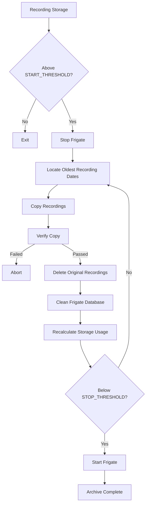

# Archive Engine

The Archive Engine is the core component of Frigate Archive.

It automatically moves completed Frigate recordings from fast recording storage to long-term archive storage while maintaining data integrity throughout the process.

> **Documentation Version:** v2.3.0  
> Applies to Frigate Archive v2.2.0 and later.

---

## In This Guide

- Why the Archive Engine exists
- How the archive workflow operates
- Storage thresholds
- Verification
- Database cleanup
- Test Mode
- Logging
- Safety mechanisms
- Best practices

---

## Prerequisites

Before using the Archive Engine:

- Frigate Archive must be installed
- `config.conf` must be configured
- Health Check should pass
- TEST_MODE should be enabled for initial testing

---

# Why the Archive Engine Exists

Frigate performs best when recording to fast storage such as an SSD or cache drive.

Over time, recordings accumulate and storage usage increases.

Rather than allowing the recording drive to fill completely, the Archive Engine automatically moves older recordings to long-term storage while helping keep the recording drive within user-defined limits.

---

# Archive Workflow



---

# Storage Thresholds

The Archive Engine uses two storage thresholds.

## START_THRESHOLD

Example:

```text
60%
```

When recording storage reaches this value, the Archive Engine begins archiving.

---

## STOP_THRESHOLD

Example:

```text
40%
```

Archiving continues until storage falls below this value.

---

# Why Two Thresholds?

Using separate thresholds prevents the Archive Engine from repeatedly starting and stopping when storage usage fluctuates around a single value.

This technique is commonly known as **hysteresis**.

---

# Verification

Frigate Archive never deletes recordings immediately after copying them.

Instead, it performs verification first.

The workflow is:

```text
Copy

↓

Verify

↓

Delete Original

↓

Database Cleanup
```

If verification fails:

- Original recordings remain untouched.
- Frigate continues to use the existing files.
- The archive operation stops safely.

---

# Database Cleanup

After recordings are successfully archived, Frigate Archive removes database entries that reference recordings no longer stored on the recording drive.

This helps prevent:

- Incorrect storage statistics
- Broken recording references
- Missing timeline entries
- Orphaned metadata

---

# Logging

Every archive operation generates detailed log output.

The log records:

- Archive start time
- Storage usage
- Selected recording dates
- Transfer progress
- Verification results
- Database cleanup
- Completion status

These logs are useful when troubleshooting archive operations.

---

# Test Mode

During initial setup, keep:

```bash
TEST_MODE=true
```

Test Mode allows you to validate the complete archive workflow without moving recordings or modifying the Frigate database.

Once you are satisfied everything is working correctly:

```bash
TEST_MODE=false
```

---

# Safety Features

The Archive Engine includes multiple layers of protection.

- Runtime lock files
- Verification before deletion
- Automatic Frigate stop/start
- Health Check validation
- Database backup
- Configuration validation
- Threshold protection

These safeguards are designed to minimise the risk of data loss.

---

# Best Practices

- Record to SSD or cache storage.
- Archive to parity-protected array storage.
- Test using Test Mode first.
- Run Health Check after configuration changes.
- Monitor archive logs regularly.
- Verify restored recordings before deleting archive copies.

---

# Common Problems

## Archive never starts

Check:

- START_THRESHOLD
- Recording storage usage
- TEST_MODE
- Health Check

---

## Verification fails

Check:

- Archive destination
- Available storage
- File permissions

---

## Database cleanup reports warnings

Run:

```bash
bash healthcheck.sh
```

Review the generated log before running another archive.

---

## Related Guides

- [Configuration](configuration.md)
- [Restore Wizard](restore-wizard.md)
- [Health Check](healthcheck.md)
- [Troubleshooting](troubleshooting.md)
