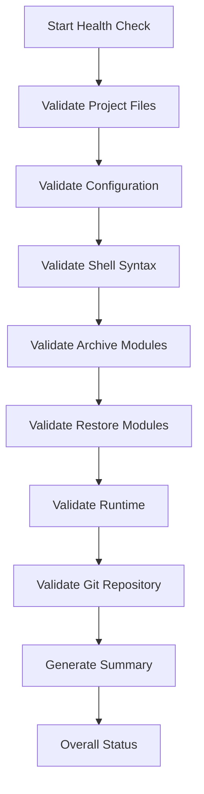

# Health Check

The Health Check utility validates your Frigate Archive installation and helps identify problems before they affect archive or restore operations.

Rather than checking a single component, it performs a comprehensive series of validation tests covering the project, configuration, runtime environment, and Git repository.

> **Documentation Version:** v2.3.0  
> Applies to Frigate Archive v2.2.0 and later.

---

## In This Guide

- Why the Health Check exists
- Validation workflow
- Understanding the results
- Common warnings
- Common failures
- Best practices

---

## Prerequisites

Before running the Health Check:

- Frigate Archive should be installed
- `config.conf` should exist
- The project should be accessible from the terminal

---

# Why the Health Check Exists

The Health Check is designed to identify problems before they interrupt archive or restore operations.

It validates:

- Project structure
- Configuration
- Runtime environment
- Shell syntax
- Module integrity
- Restore Wizard
- Git repository status

Running the Health Check before opening a GitHub issue provides valuable diagnostic information and helps identify common problems quickly.

---

# Running the Health Check

Run:

```bash
bash healthcheck.sh
```

The Health Check is read-only.

It does **not**:

- Modify recordings
- Modify the Frigate database
- Change configuration
- Delete files
- Perform archive operations
- Perform restore operations

---

# Validation Workflow



---

# What Gets Checked?

The Health Check validates several areas of the project.

## Project

- Required files
- Required directories
- Project version
- File permissions

---

## Configuration

- `config.conf`
- Required variables
- Paths
- Container configuration

---

## Archive Engine

- Archive modules
- Runtime directories
- Lock files
- Archive logs

---

## Restore Wizard

- Restore modules
- Restore runtime
- Restore lock files

---

## Shell Scripts

Every project script is checked for shell syntax errors.

This helps detect accidental editing mistakes before they become runtime failures.

---

## Git Repository

If the project is inside a Git repository, the Health Check validates:

- Repository availability
- Current branch
- Current commit
- Working tree status

Uncommitted local changes generate a warning only.

---

# Understanding the Results

Typical output:

```text
Project : Frigate Archive
Version : 2.2.0

Passed  : 116
Warnings: 0
Failed  : 0

Overall Status: HEALTHY
```

---

## Passed

Passed checks indicate that the tested component is working as expected.

Higher numbers generally indicate more comprehensive validation.

---

## Warnings

Warnings identify situations that deserve attention but do not prevent Frigate Archive from operating.

Examples include:

- Uncommitted Git changes
- Optional components not installed
- Minor configuration recommendations

---

## Failed

Failed checks indicate problems that should be resolved before using Frigate Archive.

Examples include:

- Missing files
- Missing modules
- Invalid configuration
- Shell syntax errors
- Missing required commands

---

## Overall Status

Possible results include:

### HEALTHY

All required checks passed.

---

### HEALTHY WITH WARNINGS

The project is operational, but one or more warnings were detected.

Review the warning messages before deployment.

---

### FAILED

One or more critical validation checks failed.

Correct the reported problems before running archive or restore operations.

---

# When Should I Run It?

Run the Health Check:

- After installation
- After updating the project
- After editing `config.conf`
- Before enabling production archiving
- Before opening a GitHub issue
- After resolving a reported problem

---

# Best Practices

- Run the Health Check after every update.
- Resolve failures before continuing.
- Review warnings rather than ignoring them.
- Include Health Check output when reporting bugs.
- Commit Git changes before production deployments.

---

# Common Questions

## Why do I have warnings but the project still works?

Warnings highlight recommended improvements rather than critical failures.

---

## Why does Git report uncommitted changes?

This simply indicates local modifications that have not yet been committed.

During development, this is expected.

---

## Why are shell scripts checked?

Syntax validation detects problems before a script is executed, reducing the chance of runtime failures.

---

# Related Guides

- [Configuration](configuration.md)
- [Archive Engine](archive-engine.md)
- [Restore Wizard](restore-wizard.md)
- [Troubleshooting](troubleshooting.md)
- [FAQ](faq.md)
