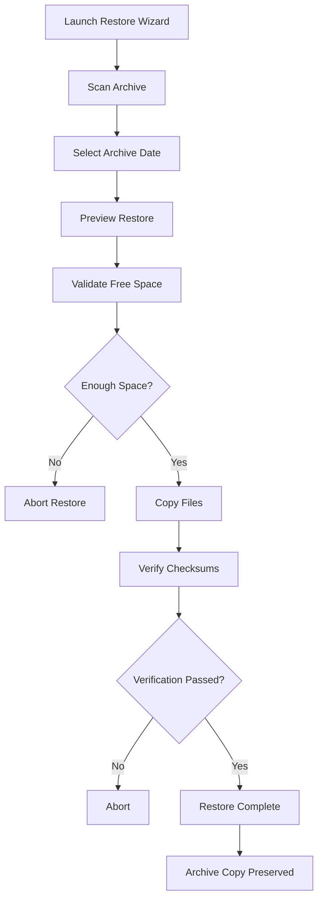

# Restore Wizard

The Restore Wizard provides a safe, interactive way to restore archived Frigate recordings back to your recording storage.

Unlike the Archive Engine, which is designed to run automatically, the Restore Wizard is intentionally interactive. Every restore is reviewed, validated, and confirmed before any files are copied.

> **Documentation Version:** v2.3.0  
> Applies to Frigate Archive v2.2.0 and later.

---

## In This Guide

- Why the Restore Wizard exists
- Restore workflow
- Selecting recordings
- Safety checks
- Verification
- Current limitations
- Best practices

---

## Prerequisites

Before restoring recordings, ensure:

- Frigate Archive is installed
- Archived recordings exist
- Recording storage has sufficient free space
- The Health Check passes successfully

---

# Why the Restore Wizard Exists

Archived recordings are intended for long-term storage.

Occasionally, recordings need to be restored for:

- Reviewing historical footage
- Investigating incidents
- Exporting evidence
- Recovering accidentally archived recordings

The Restore Wizard restores recordings while preserving the archived copy, ensuring that the archive remains the primary source of truth.

---

# Restore Workflow



---

# Launching the Restore Wizard

Run:

```bash
bash restore.sh
```

The Restore Wizard scans the configured archive location and displays all available archive dates.

Example:

```text
2026-07-05
2026-07-06
2026-07-07
2026-07-08
```

Choose the required date to continue.

---

# Restore Preview

Before any files are copied, the Restore Wizard displays a summary including:

- Selected archive date
- Number of folders
- Number of recordings
- Total size
- Destination location

This allows you to confirm that you have selected the correct archive before continuing.

---

# Free Space Validation

Before restoring recordings, the Restore Wizard checks the available free space on the recording drive.

If insufficient space is available:

- No files are copied.
- The restore operation is cancelled safely.
- The archive remains unchanged.

---

# File Verification

Every restored file is verified after copying.

The workflow is:

```text
Copy

↓

Checksum Verification

↓

Restore Complete
```

If verification fails:

- The restore stops immediately.
- Existing recordings are preserved.
- The archive remains untouched.

---

# Archive Preservation

The Restore Wizard **never removes recordings from the archive**.

The archive always remains the authoritative copy.

This allows recordings to be restored again in the future if required.

---

# Current Limitation

The Restore Wizard currently restores **recording files only**.

It does **not** recreate deleted Frigate database information such as:

- Recording database rows
- Timeline entries
- Review entries
- Preview images
- Recording metadata

Because of this, restored recordings may not immediately appear in Frigate unless matching database records already exist.

Future versions may introduce optional metadata restoration.

---

# Safety Features

The Restore Wizard includes several safeguards:

- Interactive operation
- Restore preview
- Recording-drive free-space validation
- Checksum verification
- Archive preservation
- Runtime lock protection
- Detailed logging

These safeguards are designed to minimise the risk of accidental data loss.

---

# Best Practices

- Restore only the recordings you need.
- Verify available storage before restoring.
- Leave the archive copy intact.
- Confirm restored recordings before using them.
- Run the Health Check if unexpected warnings occur.

---

# Common Problems

## No archived dates found

Verify:

- The archive path is correct.
- Archived recordings exist.
- Permissions allow the archive to be read.

---

## Restore cancelled

Usually caused by:

- Insufficient recording-drive space
- User cancellation
- Verification failure

Review the restore log for details.

---

## Restored recordings do not appear in Frigate

This is expected when the original Frigate database metadata has already been removed.

The Restore Wizard currently restores recording files only.

---

## Related Guides

- [Configuration](configuration.md)
- [Archive Engine](archive-engine.md)
- [Health Check](healthcheck.md)
- [Troubleshooting](troubleshooting.md)
- [FAQ](faq.md)
- [Developer Guide](developer-guide.md)
