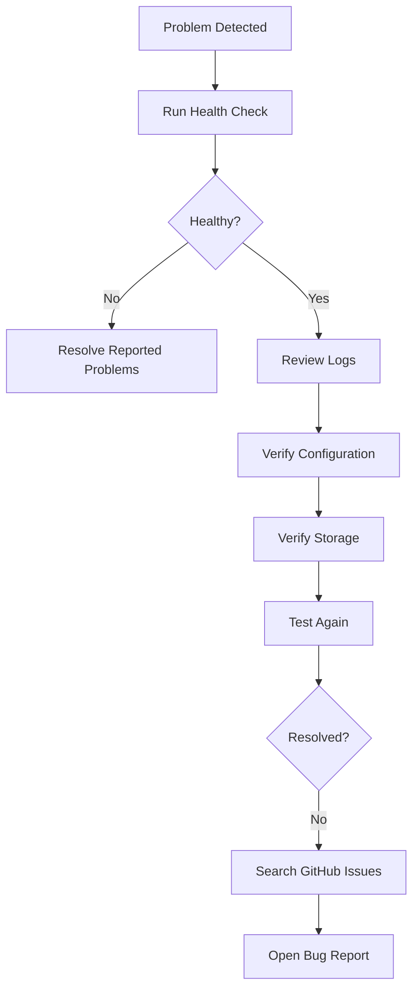

# Troubleshooting

This guide provides a structured approach to diagnosing and resolving common Frigate Archive problems.

Rather than troubleshooting individual symptoms first, follow the recommended workflow to identify the root cause before making changes.

> **Documentation Version:** v2.3.0  
> Applies to Frigate Archive v2.2.0 and later.

---

## In This Guide

- Troubleshooting workflow
- Running the Health Check
- Reviewing logs
- Configuration checks
- Storage validation
- Common problems
- Reporting bugs

---

## Prerequisites

Before troubleshooting:

- Frigate Archive is installed
- You have terminal access
- You know the location of `config.conf`

---

# Troubleshooting Workflow

Always troubleshoot in the following order.



---

# Step 1 – Run the Health Check

Start with:

```bash
bash healthcheck.sh
```

The Health Check validates:

- Project files
- Configuration
- Shell syntax
- Archive modules
- Restore modules
- Runtime environment
- Git repository

If any failures are reported, resolve them before continuing.

---

# Step 2 – Review the Logs

Archive and Restore operations generate detailed logs.

Review them for:

- Errors
- Warnings
- Failed verification
- Missing paths
- Permission issues

Logs are often the quickest way to identify what happened during an operation.

---

# Step 3 – Verify the Configuration

Open:

```bash
nano config.conf
```

Confirm:

- SOURCE
- ARCHIVE
- CONTAINER
- FRIGATE_DB
- START_THRESHOLD
- STOP_THRESHOLD
- TEST_MODE

Incorrect configuration is one of the most common causes of problems.

---

# Step 4 – Verify Storage

Confirm that:

- Recording storage is accessible.
- Archive storage is mounted.
- Sufficient free space exists.
- Permissions allow read/write access.

Useful commands:

```bash
df -h

ls "$SOURCE"

ls "$ARCHIVE"
```

---

# Common Problems

## Archive does not start

Check:

- Recording drive usage
- START_THRESHOLD
- TEST_MODE
- Health Check results

---

## Archive stops unexpectedly

Review:

- Verification results
- Runtime logs
- Available storage
- Lock files

---

## Restore Wizard shows no archive dates

Verify:

- Archive path
- Archive permissions
- Archived recordings exist

---

## Restore cancelled

Usually caused by:

- Insufficient recording-drive space
- User cancellation
- Verification failure

Review the restore log for additional information.

---

## Restored recordings do not appear in Frigate

The Restore Wizard restores recording files only.

It does not currently recreate:

- Recording database rows
- Timeline entries
- Review entries
- Preview images
- Metadata

This behaviour is expected.

---

## Health Check reports warnings

Warnings are not always failures.

Read each warning carefully.

Examples include:

- Uncommitted Git changes
- Optional components
- Development environment notices

---

## Shell syntax errors

If a shell syntax error is reported after editing a script, run:

```bash
bash -n script-name.sh
```

Replace `script-name.sh` with the script you edited.

---

# Before Opening a GitHub Issue

Please complete the following:

- Run the Health Check.
- Review the logs.
- Confirm your configuration.
- Check existing GitHub issues.
- Confirm you are using the latest release.

Including this information helps reproduce and resolve problems more quickly.

---

# Reporting Bugs

When opening an issue, include:

- Frigate Archive version
- Unraid version
- Frigate version
- Health Check summary
- Relevant log output
- Steps to reproduce the issue
- Expected behaviour
- Actual behaviour

Using the Bug Report template is strongly recommended.

---

# Best Practices

- Test configuration changes before enabling production archiving.
- Keep backups of important recordings.
- Run the Health Check after updates.
- Resolve failures before running archive or restore operations.
- Keep your project up to date.

---

## Related Guides

- [Health Check](healthcheck.md)
- [Configuration](configuration.md)
- [Archive Engine](archive-engine.md)
- [Restore Wizard](restore-wizard.md)
- [FAQ](faq.md)
- [Developer Guide](developer-guide.md)
